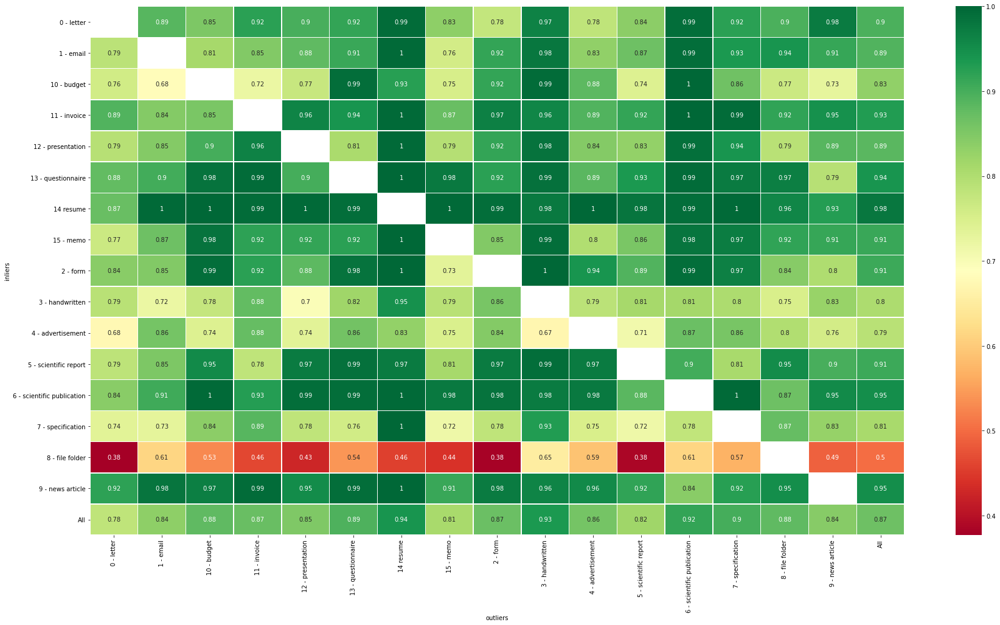
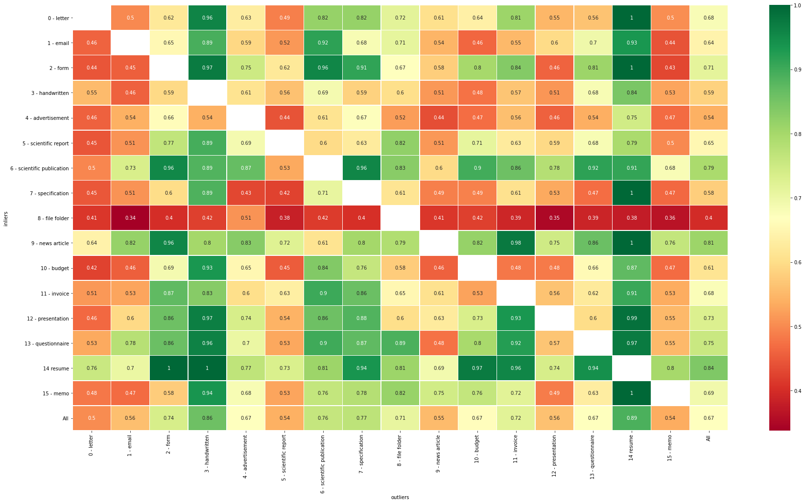
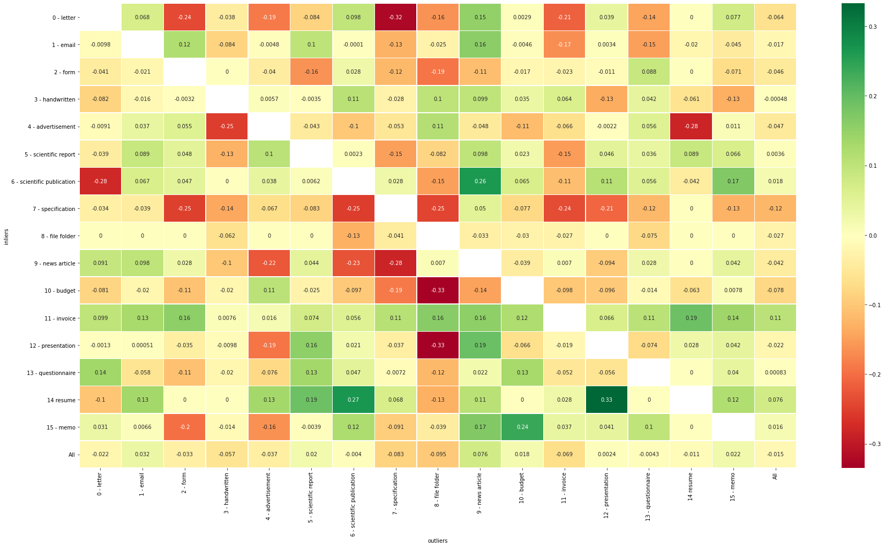
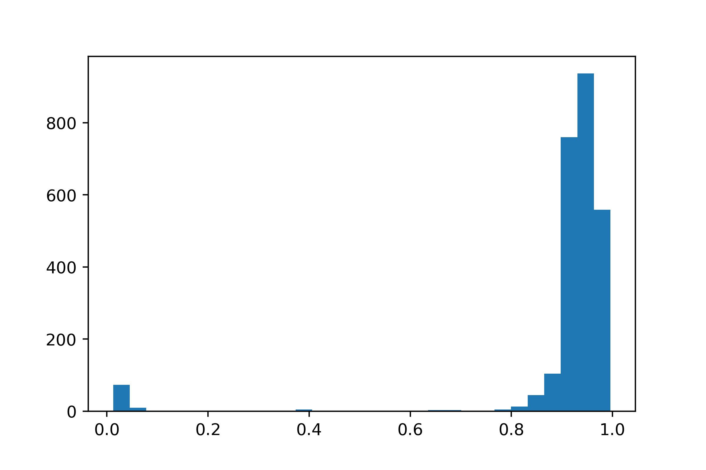

Results
=========================================

Semi-Supervised
----------------

**Pipeline**: 

Doc2Vec (trained on APNews dataset)

    \|

UMAP reduction from 300 -> 256 dimensions
    \|

ivis [#]_ (siamese network) 256 -> 1 dimension (outlier score)
    \|

use interquartile range to get outliers (fixed contamination)

|

**Dataset**: RVL-CDIP

**Train-test split**: 80 - 20

**Labeled data**: 0.8 or 1.0 (all)

**K-fold**: k = 4

**Training results**:

**Test results**:

**Difference 0.8 and 1.0 of data labelled**:

**Split Data into inliers and outliers**:

**Inlier data**: letter, form, email, invoice

**Outlier data**: handwritten, advertisement, scientific report, scientific publication, 
specification, file folder, news article, budget, presentation, questionnaire, 
resume, memo

**Table** - Contamination (between 5% and 20%) and Labeled data (between 10% and 100%):

===========  ==========  =======  =========  ========  ========  ==========  =========
..             f1_macro    in_f1    in_prec    in_rec    out_f1    out_prec    out_rec
===========  ==========  =======  =========  ========  ========  ==========  =========
(0.05, 0.1)        0.46     0.89       0.95      0.85      0.03        0.02       0.05
(0.05, 0.4)        0.45     0.9        0.95      0.85      0.01        0.01       0.02
(0.05, 0.7)        0.46     0.9        0.95      0.86      0.01        0.01       0.02
(0.05, 1.0)        0.51     0.97       0.95      0.99      0.04        0.34       0.02
(0.1, 0.1)         0.43     0.85       0.89      0.81      0.02        0.01       0.03
(0.1, 0.4)         0.45     0.87       0.9       0.85      0.02        0.01       0.02
(0.1, 0.7)         0.43     0.85       0.89      0.81      0.02        0.01       0.03
(0.1, 1.0)         0.54     0.95       0.91      0.99      0.13        0.64       0.08
(0.2, 0.1)         0.43     0.78       0.81      0.75      0.09        0.08       0.11
(0.2, 0.4)         0.43     0.78       0.81      0.76      0.08        0.06       0.09
(0.2, 0.7)         0.43     0.78       0.81      0.76      0.07        0.06       0.08
(0.2, 1.0)     **0.67**     0.92       0.87      0.98  **0.41**        0.76       0.28
===========  ==========  =======  =========  ========  ========  ==========  =========

Supervised
-----------

**Pipeline**: 

Doc2Vec (trained on APNews dataset)

    \|

UMAP reduction from 300 -> 256 dimensions
    \|

Small FC-NN
    \|

256 - 128 - 64 - 16 - 1

|

**Dataset**: RVL-CDIP

**Inlier data**: letter, form, email, invoice

**Outlier data**: handwritten, advertisement, scientific report, scientific publication, 
specification, file folder, news article, budget, presentation, questionnaire, 
resume, memo

**Contamination**: 0.1

**Training data**: 

====  =====
  0      1
====  =====
 918   9191
====  =====

**Test data input**:

===  ====
  0     1
===  ====
230  2298
===  ====

**Outputs** (predicted values of the binary classifier):

**Predictions** (with threshold 0.5):

===  ====
  0     1
===  ====
 96  2432
===  ====

**Scores**:

====  ==========  =======  ========  =========  ========  =========  ==========
  ..    f1_macro    in_f1    in_rec    in_prec    out_f1    out_rec    out_prec
====  ==========  =======  ========  =========  ========  =========  ==========
   0       0.733    0.965     0.991       0.94     0.501      0.365         0.8
====  ==========  =======  ========  =========  ========  =========  ==========

**Outlier Exposure** [#]_

Adding n out-of-distribution samples as outliers had no 
or negative influence. n = 200 and n = 1000 had a run that with out_f1 = 0 (everything was detected as
inlier) which suggests that it destabilizes the network's training
(tested over 3 runs with 2000 samples per class for the aforementioned split):

====  ==========  =======  =========  ========  ========  ==========  =========
  ..    f1_macro    in_f1    in_prec    in_rec    out_f1    out_prec    out_rec
====  ==========  =======  =========  ========  ========  ==========  =========
   0        0.69     0.96       0.93         1      0.41        0.88       0.27
  50        0.68     0.96       0.93         1      0.41        0.87       0.27
 200        0.61     0.96       0.92         1      0.27        0.57       0.17
1000        0.62     0.96       0.92         1      0.28        0.55       0.19
====  ==========  =======  =========  ========  ========  ==========  =========

| 

**More data** improves performance up to around 5000 samples per class 
(before accounting for using only 10% of outlier classes and 80% of all data for training)

=====  ==========  =======  =========  ========  ========  ==========  =========
   ..    f1_macro    in_f1    in_prec    in_rec    out_f1    out_prec    out_rec
=====  ==========  =======  =========  ========  ========  ==========  =========
  100        0.49     0.95       0.91      1         0.03        0.33       0.01
  500        0.56     0.96       0.92      1         0.16        0.88       0.09
 1000        0.65     0.96       0.93      1         0.34        0.95       0.2
 2000        0.71     0.97       0.93      1         0.45        0.94       0.3
 5000        0.74     0.97       0.94      0.99      0.51        0.87       0.36
10000        0.74     0.97       0.94      0.99      0.52        0.87       0.37
=====  ==========  =======  =========  ========  ========  ==========  =========

**Different models for vectorization**:

============================  ==========  =======  =========  ========  ========  ==========  =========
..                              f1_macro    in_f1    in_prec    in_rec    out_f1    out_prec    out_rec
============================  ==========  =======  =========  ========  ========  ==========  =========
allenai/longformer-base*            0.75     0.97       0.94      0.99      0.53        0.79       0.4
Doc2Vec all_news                    0.75     0.97       0.94      0.99      0.53        0.85       0.39
Doc2Vec apnews                      0.69     0.96       0.93      1         0.41        0.89       0.27
doc2vec wiki                        0.74     0.97       0.94      0.99      0.51        0.87       0.36
============================  ==========  =======  =========  ========  ========  ==========  =========

Longformer model had only half the data and didn't use the big version

| 

.. [#] https://github.com/beringresearch/ivis
.. [#] https://github.com/hendrycks/outlier-exposure
