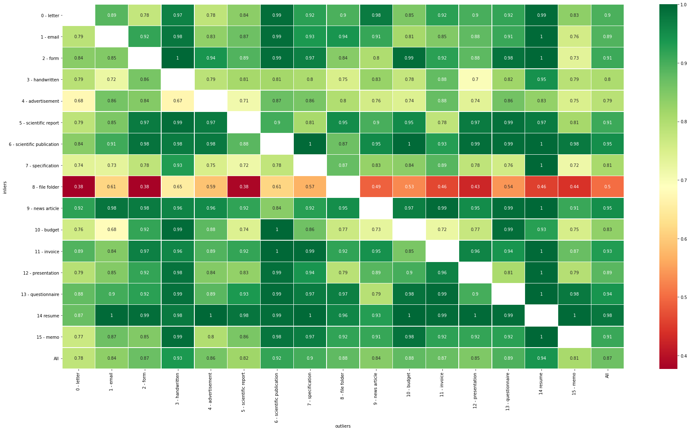

Results
=========================================

Semi-Supervised
----------------

**Pipeline**: 

Doc2Vec (trained on APNews dataset)

    \|

UMAP reduction from 300 -> 256 dimensions
    \|

ivis_ (siamese network) 256 -> 1 dimension (outlier score)
    \|

use interquartile range to get outliers (fixed contamination)

|

**Dataset**: RVL-CDIP

**Train-test split**: 80 - 20

**Labeled data**: 0.8 or 1.0 (all)

**K-fold**: k = 4

**Training results**:

**Test results**:

**Difference 0.8 and 1.0 of data labelled**:

.. image:: semisupervised/pairwise-08-10-diff.png

Supervised
-----------

**Pipeline**: 

Doc2Vec (trained on APNews dataset)

    \|

UMAP reduction from 300 -> 256 dimensions
    \|

Small FC-NN
    \|

256 - 128 - 64 - 16 - 1

|

**Dataset**: RVL-CDIP

**Inlier data**: letter, form, email, invoice

**Outlier data**: handwritten, advertisement, scientific report, scientific publication, 
specification, file folder, news article, budget, presentation, questionnaire, 
resume, memo

**Contamination**: 0.1

**Training data**: 

====  =====
  0      1
====  =====
 918   9191
====  =====

**Test data input**:

===  ====
  0     1
===  ====
230  2298
===  ====

**Outputs**:

**Predictions** (with threshold 0.5):

===  ====
  0     1
===  ====
 96  2432
===  ====

**Scores**:

====  ==========  =======  ========  =========  ========  =========  ==========
  ..    f1_macro    in_f1    in_rec    in_prec    out_f1    out_rec    out_prec
====  ==========  =======  ========  =========  ========  =========  ==========
   0       0.733    0.965     0.991       0.94     0.501      0.365         0.8
====  ==========  =======  ========  =========  ========  =========  ==========

.. _ivis: https://github.com/beringresearch/ivis